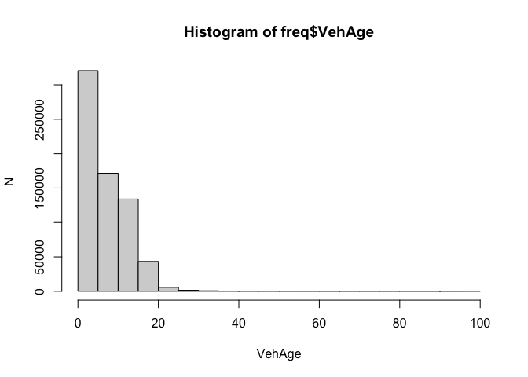
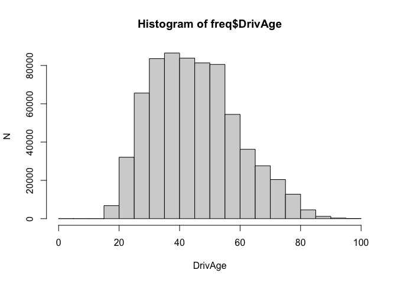
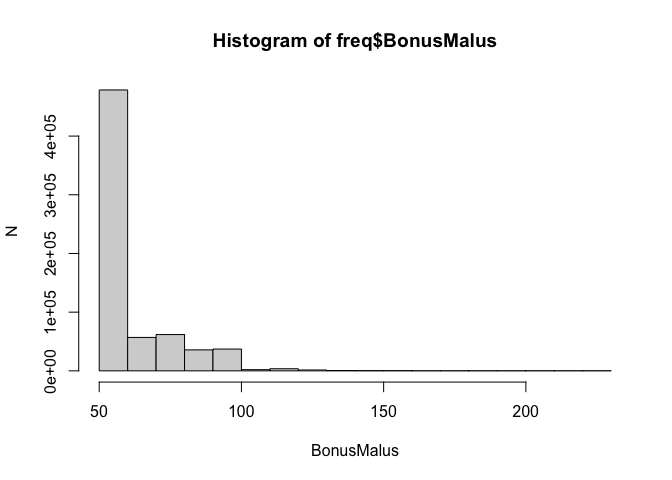

# Data Checks and Cleaning Decisions (freMTPL2)


## Purpose

Check the consistency and distribution of freMTPL2 and decide how each
variable is cleaned. The cleaning follows Noll et al.(2018) unless
stated otherwise.

``` r
library(here)
library(data.table)
library(ggplot2)

freq <- as.data.table(readRDS(here("data", "raw", "freMTPL2freq.rds")))
sev <- as.data.table(readRDS(here("data", "raw", "freMTPL2sev.rds")))

freq[, IDpol := as.integer(as.character(IDpol))]
sev[, IDpol := as.integer(as.character(IDpol))]

str(freq)
```

    Classes 'data.table' and 'data.frame':  677991 obs. of  12 variables:
     $ IDpol     : int  1 3 5 10 11 13 15 17 18 21 ...
     $ ClaimNb   : num  0 0 0 0 0 0 0 0 0 0 ...
     $ Exposure  : num  0.1 0.77 0.75 0.09 0.84 0.52 0.45 0.27 0.71 0.15 ...
     $ VehPower  : int  5 5 6 7 7 6 6 7 7 7 ...
     $ VehAge    : int  0 0 2 0 0 2 2 0 0 0 ...
     $ DrivAge   : int  55 55 52 46 46 38 38 33 33 41 ...
     $ BonusMalus: int  50 50 50 50 50 50 50 68 68 50 ...
     $ VehBrand  : Factor w/ 11 levels "B1","B10","B11",..: 4 4 4 4 4 4 4 4 4 4 ...
     $ VehGas    : Factor w/ 2 levels "Diesel","Regular": 2 2 1 1 1 2 2 1 1 1 ...
     $ Area      : Factor w/ 6 levels "A","B","C","D",..: 4 4 2 2 2 5 5 3 3 2 ...
     $ Density   : int  1217 1217 54 76 76 3003 3003 137 137 60 ...
     $ Region    : Factor w/ 22 levels "Alsace","Aquitaine",..: 22 22 19 2 2 17 17 13 13 18 ...
     - attr(*, ".internal.selfref")=<pointer: 0x1210104e0> 

``` r
str(sev)
```

    Classes 'data.table' and 'data.frame':  26444 obs. of  2 variables:
     $ IDpol      : int  1552 1010996 4024277 4007252 4046424 4073956 4012173 4020812 4020812 4074074 ...
     $ ClaimAmount: num  995 1128 1851 1204 1204 ...
     - attr(*, ".internal.selfref")=<pointer: 0x1210104e0> 

``` r
# Check that ClaimNb in freq matches the number of claims recorded in sev
sev_count <- sev[, .(SevNb = .N), by = IDpol]

check <- merge(
  freq[, .(IDpol, ClaimNb)],
  sev_count,
  by = "IDpol",
  all.x = TRUE
)

check[is.na(SevNb), SevNb := 0]    # policies not in sev have no recorded claims

check[, consistent := ClaimNb == SevNb]

table(check$consistent)
```


      TRUE 
    677991 

``` r
# Claims in sev whose policy is missing from freq
sev[!freq, on = "IDpol", .N]
```

    [1] 0

## 1. Frequency data

### 1.1 ClaimNb

``` r
freq[, .N, by = ClaimNb][order(ClaimNb)]
```

        ClaimNb      N
          <num>  <int>
     1:       0 653047
     2:       1  23571
     3:       2   1298
     4:       3     62
     5:       4      5
     6:       5      2
     7:       6      1
     8:       8      1
     9:       9      1
    10:      11      2
    11:      16      1

``` r
freq[ClaimNb >= 4, .(ClaimNb, Exposure, annual_rate = ClaimNb / Exposure)][order(-ClaimNb)]
```

        ClaimNb Exposure annual_rate
          <num>    <num>       <num>
     1:      16     0.33   48.484848
     2:      11     0.08  137.500000
     3:      11     0.07  157.142857
     4:       9     0.08  112.500000
     5:       8     0.41   19.512195
     6:       6     0.33   18.181818
     7:       5     1.00    5.000000
     8:       5     0.08   62.500000
     9:       4     0.56    7.142857
    10:       4     0.27   14.814815
    11:       4     0.10   40.000000
    12:       4     0.49    8.163265
    13:       4     0.57    7.017544

**Decision**: Following previous studies, we cap ClaimNb at 4 to limit
the effect of extreme claim counts.

### 1.2 Exposure

``` r
freq[Exposure > 1, .N]
```

    [1] 1224

**Decision**: Following previous studies, we cap Exposure at 1.0. Values
above 1 contradict to the definition.

### 1.3 VehPower

``` r
freq[, .N, by = VehPower][order(VehPower)]
```

        VehPower      N
           <int>  <int>
     1:        4 115344
     2:        5 124815
     3:        6 148972
     4:        7 145398
     5:        8  46954
     6:        9  30084
     7:       10  31353
     8:       11  18352
     9:       12   8214
    10:       13   3229
    11:       14   2350
    12:       15   2926

**Decision**: VehPower has some sparse high-power groups and also shows
an implausible upward turn at the maximum. Following previous studies,
we deal with it as a categorical variable and group values of 9 and
above into a single group.

### 1.4 VehAge

``` r
summary(freq$VehAge)
```

       Min. 1st Qu.  Median    Mean 3rd Qu.    Max. 
      0.000   2.000   6.000   7.044  11.000 100.000 

``` r
hist(
  freq$VehAge,
  breaks = seq(0, 100, by = 5),
  xlab = "VehAge",
  ylab = "N"
)
```



``` r
freq[VehAge >= 80, .N, by = VehAge][order(VehAge)]
```

       VehAge     N
        <int> <int>
    1:     80     3
    2:     81     3
    3:     82     1
    4:     83     2
    5:     84     1
    6:     85     1
    7:     99    23
    8:    100    25

**Decision**: VehAge is grouped into classes and treated as a
categorical variable, following previous studies. The open-ended top
class absorbs the sparse and erratic observations at the upper end.

### 1.5 DrivAge

``` r
summary(freq$DrivAge)
```

       Min. 1st Qu.  Median    Mean 3rd Qu.    Max. 
       18.0    34.0    44.0    45.5    55.0   100.0 

``` r
hist(
  freq$DrivAge,
  breaks = seq(0, 100, by = 5),
  xlab = "DrivAge",
  ylab = "N"
)
```



``` r
freq[DrivAge >= 91, .N, by = DrivAge][order(DrivAge)]
```

        DrivAge     N
          <int> <int>
     1:      91   121
     2:      92    66
     3:      93    55
     4:      94    32
     5:      95    24
     6:      96    15
     7:      97    10
     8:      98     5
     9:      99    70
    10:     100     3

**Decision**: DrivAge is grouped into classes and treated as a
categorical variable, following previous studies. The open-ended top
class absorbs the sparse and erratic observations at 99.

### 1.6 BonusMalus

``` r
summary(freq$BonusMalus)
```

       Min. 1st Qu.  Median    Mean 3rd Qu.    Max. 
      50.00   50.00   50.00   59.76   64.00  230.00 

``` r
hist(
  freq$BonusMalus,
  breaks = seq(50, 230, by = 10),
  xlab = "BonusMalus",
  ylab = "N"
)
```



**Decision**: We cap it at 150 by following previous studies.

### 1.7 Area vs Density

``` r
summary(freq$Area)
```

         A      B      C      D      E      F 
    103952  75457 191874 151592 137163  17953 

``` r
summary(freq$Density)
```

       Min. 1st Qu.  Median    Mean 3rd Qu.    Max. 
          1      92     393    1792    1658   27000 

``` r
cor(as.integer(freq$Area), log(freq$Density))
```

    [1] 0.9706184

**Decision**: We use only log Density.

## 2. Severity data

``` r
# Share of the total claim amount from the largest 1, 5, 10 and 50 claims
sev[order(-ClaimAmount),
  .(top_k = c(1, 5, 10, 50),
    share = cumsum(ClaimAmount)[c(1, 5, 10, 50)] / sum(ClaimAmount))]
```

       top_k      share
       <num>      <num>
    1:     1 0.06802627
    2:     5 0.13261372
    3:    10 0.15843920
    4:    50 0.25883965

``` r
sev[order(-ClaimAmount)][1:10]
```

          IDpol ClaimAmount
          <int>       <num>
     1: 1120377   4075400.6
     2:  110846   1403057.4
     3: 2141337   1301172.6
     4: 3122016    774411.5
     5: 2008127    390742.3
     6: 3025890    369131.9
     7: 1117644    307096.4
     8:  158309    301635.5
     9: 3075820    287423.0
    10: 3150210    281897.5

``` r
# For each candidate cap u:
#   pct_excess: share of the total amount above u
#   load_L    : flat load that restores the uncapped total
thr <- c(1e4, 2e4, 5e4, 1e5, 2e5, 5e5)

rbindlist(lapply(thr, function(u) sev[, .(
  u          = u,
  n_above    = sum(ClaimAmount > u),
  pct_count  = mean(ClaimAmount > u),
  pct_excess = sum(pmax(ClaimAmount - u, 0)) / sum(ClaimAmount),
  load_L     = sum(ClaimAmount) / sum(pmin(ClaimAmount, u))
)]))
```

           u n_above    pct_count pct_excess   load_L
       <num>   <int>        <num>      <num>    <num>
    1: 1e+04     478 0.0180759340 0.34543708 1.527737
    2: 2e+04     215 0.0081303887 0.29301079 1.414449
    3: 5e+04      88 0.0033277870 0.22563021 1.291373
    4: 1e+05      41 0.0015504462 0.17705156 1.215143
    5: 2e+05      20 0.0007563152 0.12867451 1.147677
    6: 5e+05       4 0.0001512630 0.09270764 1.102181

**Decision**: Claim amounts are capped at 100k per claim. This affects
only 41 claims (0.16%) and limits the influence of extreme losses on the
Gamma GLM. The excess (17.7% of the amount) is added back through a flat
load L ≈ 1.22 on the full data; the load used in the model is
re-estimated on the training data.

## References

Noll, A., Salzmann, R. and Wüthrich, M. V. (2018). [Case Study: French
Motor Third-Party Liability
Claims](https://papers.ssrn.com/sol3/papers.cfm?abstract_id=3164764).
SSRN.

## Session Info

``` r
sessionInfo()
```

    R version 4.6.1 (2026-06-24)
    Platform: aarch64-apple-darwin23
    Running under: macOS Sonoma 14.2

    Matrix products: default
    BLAS:   /Library/Frameworks/R.framework/Versions/4.6/Resources/lib/libRblas.0.dylib 
    LAPACK: /Library/Frameworks/R.framework/Versions/4.6/Resources/lib/libRlapack.dylib;  LAPACK version 3.12.1

    locale:
    [1] en_US.UTF-8/en_US.UTF-8/en_US.UTF-8/C/en_US.UTF-8/en_US.UTF-8

    time zone: Europe/Zurich
    tzcode source: internal

    attached base packages:
    [1] stats     graphics  grDevices utils     datasets  methods   base     

    other attached packages:
    [1] ggplot2_4.0.3       data.table_1.18.6.1 here_1.0.2         

    loaded via a namespace (and not attached):
     [1] vctrs_0.7.3        cli_3.6.6          knitr_1.52         rlang_1.3.0       
     [5] xfun_0.61          otel_0.2.0         generics_0.1.4     S7_0.2.2          
     [9] jsonlite_2.0.0     glue_1.8.1         rprojroot_2.1.1    htmltools_0.5.9   
    [13] scales_1.4.0       rmarkdown_2.32     grid_4.6.1         tibble_3.3.1      
    [17] evaluate_1.0.5     fastmap_1.2.0      yaml_2.3.12        lifecycle_1.0.5   
    [21] compiler_4.6.1     dplyr_1.2.1        RColorBrewer_1.1-3 pkgconfig_2.0.3   
    [25] rstudioapi_0.19.0  farver_2.1.2       digest_0.6.39      R6_2.6.1          
    [29] tidyselect_1.2.1   pillar_1.11.1      magrittr_2.0.5     withr_3.0.3       
    [33] tools_4.6.1        gtable_0.3.6      
