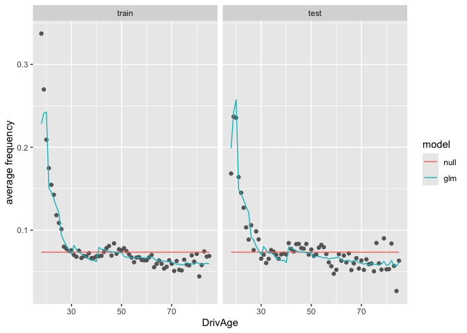
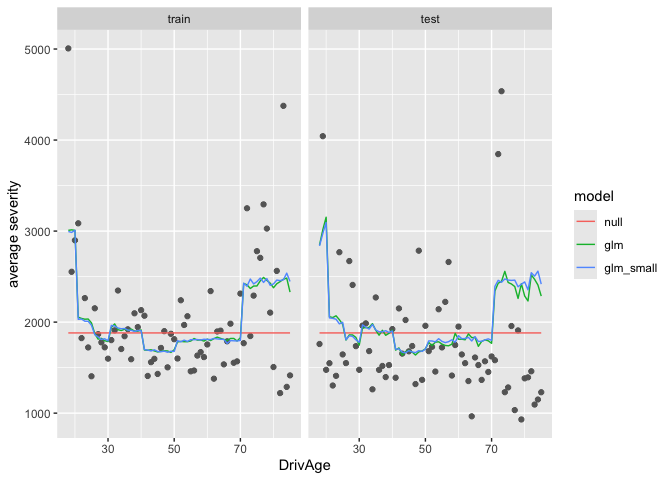
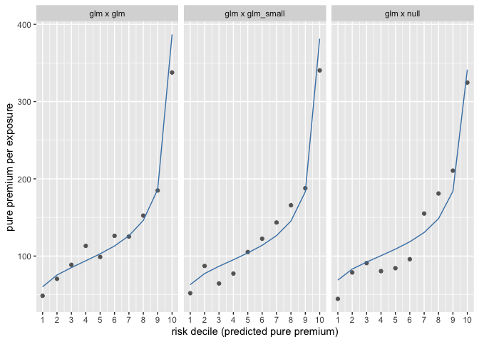

# Pure Premium Modelling with Frequency-Severity GLMs (freMTPL2)


## Summary

- **Frequency:** A Poisson GLM beat the intercept-only baseline by 4.4%
  in test deviance, mainly by capturing the high claim rates of young
  drivers.
- **Severity:** Gamma GLMs overfit to a few large claims and did worse
  than a constant mean on the test set, so the baseline is the better
  choice here.
- **Pure premium:** Frequency GLM × constant severity ranked risks best
  on the test set (Gini 0.31, top-to-bottom decile lift 7.3); adding a
  severity GLM did not help.
- **Calibration:** All models match the total claim level on the
  training data (A/E ≈ 1); the test deviations of 2–4% are within
  sampling noise.

## Data

We use the French motor third-party liability data freMTPL2 from
CASdatasets. The cleaning decisions are documented in
`02_data_check.qmd`. Policies are randomly split 80/20 into train and
test sets, and all claims of a policy go to the same set.

``` r
library(here)
library(data.table)
library(ggplot2)

source(here("R", "preprocess.R"))
source(here("R", "split.R"))
source(here("R", "metrics.R"))

freq <- as.data.table(readRDS(here("data", "raw", "freMTPL2freq.rds")))
sev <- as.data.table(readRDS(here("data", "raw", "freMTPL2sev.rds")))

dat <- do.call(split_data, prepare_data(freq, sev))

summary(dat$freq_train)
```

         IDpol            ClaimNb          Exposure           VehPower     
     Min.   :      1   Min.   :0.0000   Min.   :0.002732   Min.   : 4.000  
     1st Qu.:1157134   1st Qu.:0.0000   1st Qu.:0.170000   1st Qu.: 5.000  
     Median :2271781   Median :0.0000   Median :0.490000   Median : 6.000  
     Mean   :2620095   Mean   :0.0388   Mean   :0.528439   Mean   : 6.455  
     3rd Qu.:4045507   3rd Qu.:0.0000   3rd Qu.:0.990000   3rd Qu.: 7.000  
     Max.   :6114330   Max.   :4.0000   Max.   :1.000000   Max.   :15.000  
                                                                           
         VehAge           DrivAge        BonusMalus        VehBrand     
     Min.   :  0.000   Min.   : 18.0   Min.   : 50.00   B12    :132751  
     1st Qu.:  2.000   1st Qu.: 34.0   1st Qu.: 50.00   B1     :129898  
     Median :  6.000   Median : 44.0   Median : 50.00   B2     :127946  
     Mean   :  7.044   Mean   : 45.5   Mean   : 59.77   B3     : 42778  
     3rd Qu.: 11.000   3rd Qu.: 55.0   3rd Qu.: 64.00   B5     : 27905  
     Max.   :100.000   Max.   :100.0   Max.   :150.00   B6     : 22795  
                                                        (Other): 58320  
         VehGas       Area          Density     
     Diesel :265735   A: 83097   Min.   :    1  
     Regular:276658   B: 60296   1st Qu.:   92  
                      C:153324   Median :  393  
                      D:121462   Mean   : 1795  
                      E:109803   3rd Qu.: 1662  
                      F: 14411   Max.   :27000  
                                                
                             Region       VehPowerGrp VehAgeGrp     DrivAgeGrp    
     Centre                     :128229   4: 92332    0   : 46154   18-20:  5490  
     Rhone-Alpes                : 67850   5: 99716    1-10:347660   21-25: 25726  
     Provence-Alpes-Cotes-D'Azur: 63453   6:118975    11+ :148579   26-30: 52380  
     Ile-de-France              : 55845   7:116564                  31-40:136125  
     Bretagne                   : 33890   8: 37521                  41-50:132079  
     Pays-de-la-Loire           : 31041   9: 77285                  51-70:159106  
     (Other)                    :162085                             71+  : 31487  
       LogDensity            fold       
     Min.   : 0.000   Length   :542393  
     1st Qu.: 4.522   N.unique :     1  
     Median : 5.974   N.blank  :     0  
     Mean   : 5.984   Min.nchar:     5  
     3rd Qu.: 7.416   Max.nchar:     5  
     Max.   :10.204                     
                                        

``` r
summary(dat$sev_train)
```

         IDpol            ClaimNb         Exposure          VehPower     
     Min.   :    139   Min.   :1.000   Min.   :0.00274   Min.   : 4.000  
     1st Qu.:1086496   1st Qu.:1.000   1st Qu.:0.44000   1st Qu.: 5.000  
     Median :2136810   Median :1.000   Median :0.76000   Median : 6.000  
     Mean   :2287683   Mean   :1.121   Mean   :0.69093   Mean   : 6.474  
     3rd Qu.:3187469   3rd Qu.:1.000   3rd Qu.:1.00000   3rd Qu.: 7.000  
     Max.   :6113971   Max.   :4.000   Max.   :1.00000   Max.   :15.000  
                                                                         
         VehAge          DrivAge        BonusMalus        VehBrand   
     Min.   : 0.000   Min.   :18.00   Min.   : 50.00   B1     :5445  
     1st Qu.: 3.000   1st Qu.:34.00   1st Qu.: 50.00   B2     :5432  
     Median : 7.000   Median :45.00   Median : 55.00   B12    :3406  
     Mean   : 7.357   Mean   :45.07   Mean   : 65.25   B3     :1931  
     3rd Qu.:11.000   3rd Qu.:54.00   3rd Qu.: 76.00   B5     :1344  
     Max.   :99.000   Max.   :99.00   Max.   :150.00   B6     : 995  
                                                       (Other):2521  
         VehGas      Area        Density                              Region    
     Diesel :10707   A:2697   Min.   :    2   Centre                     :5168  
     Regular:10367   B:2093   1st Qu.:  115   Rhone-Alpes                :3380  
                     C:5637   Median :  528   Provence-Alpes-Cotes-D'Azur:2398  
                     D:5172   Mean   : 2021   Ile-de-France              :2049  
                     E:4851   3rd Qu.: 2252   Bretagne                   :1499  
                     F: 624   Max.   :27000   Pays-de-la-Loire           :1244  
                                              (Other)                    :5336  
     VehPowerGrp VehAgeGrp    DrivAgeGrp     LogDensity       ClaimAmount       
     4:3169      0   :  936   18-20: 498   Min.   : 0.6931   Min.   :      1.0  
     5:4085      1-10:14289   21-25:1470   1st Qu.: 4.7449   1st Qu.:    686.3  
     6:4981      11+ : 5849   26-30:1878   Median : 6.2691   Median :   1172.0  
     7:4510                   31-40:4632   Mean   : 6.1921   Mean   :   2163.4  
     8:1319                   41-50:5272   3rd Qu.: 7.7196   3rd Qu.:   1204.0  
     9:3010                   51-70:6047   Max.   :10.2036   Max.   :1403057.4  
                              71+  :1277                                        
     ClaimAmountCap            fold      
     Min.   :     1.0   Length   :21074  
     1st Qu.:   686.3   N.unique :    1  
     Median :  1172.0   N.blank  :    0  
     Mean   :  1881.3   Min.nchar:    5  
     3rd Qu.:  1204.0   Max.nchar:    5  
     Max.   :100000.0                    
                                         

## Frequency

We fit a Poisson GLM with log exposure as an offset and compare it with
an intercept-only model on the test set.

``` r
freq_m0 <- glm(ClaimNb ~ 1 + offset(log(Exposure)),
               family = poisson(), data = dat$freq_train)

freq_m1 <- glm(
  ClaimNb ~ VehPowerGrp + VehAgeGrp + DrivAgeGrp + BonusMalus +
    VehBrand + VehGas + LogDensity + Region + offset(log(Exposure)),
  family = poisson(),
  data = dat$freq_train
)

freq_models <- list(null = freq_m0, glm = freq_m1)

freq_result <- rbindlist(lapply(freq_models, function(m) {
  mu <- predict(m, dat$freq_test, type = "response")
  freq_metrics(dat$freq_test$ClaimNb, mu)
}), idcol = "model")

knitr::kable(freq_result, digits = 4)
```

| model | deviance |     ae |
|:------|---------:|-------:|
| null  |   0.2550 | 1.0181 |
| glm   |   0.2437 | 1.0216 |

The GLM reduces test deviance by about 4.4% relative to the
intercept-only model.

### Actual vs predicted by driver age

Points show the observed and lines the predicted average frequency. Ages
85 and above are pooled into 85.

``` r
freq_by_age <- function(models, data) {
  d <- data[, .(DrivAge = pmin(DrivAge, 85), Exposure, actual = ClaimNb)]
  for (nm in names(models)) d[, (nm) := predict(models[[nm]], data, type = "response")]
  d <- melt(d, id.vars = c("DrivAge", "Exposure"), variable.name = "series", value.name = "y")
  d[, .(freq = sum(y) / sum(Exposure)), by = .(DrivAge, series)]
}

freq_plot <- rbindlist(list(
  train = freq_by_age(freq_models, dat$freq_train),
  test = freq_by_age(freq_models, dat$freq_test)
), idcol = "data")
freq_plot[, data := factor(data, c("train", "test"))]

ggplot(mapping = aes(DrivAge, freq)) +
  geom_point(data = freq_plot[series == "actual"], colour = "grey40") +
  geom_line(data = freq_plot[series != "actual"], aes(colour = series)) +
  facet_wrap(~ data) +
  labs(x = "DrivAge", y = "average frequency", colour = "model")
```



The GLM captures the high claim frequency of young drivers.

## Severity

We fit Gamma GLMs with a log link on the capped claim amounts: a full
model with the same variables as the frequency model, and a smaller
model without VehBrand and Region.

``` r
sev_m0 <- glm(ClaimAmountCap ~ 1, family = Gamma(link = "log"), data = dat$sev_train)

sev_m1 <- glm(
  ClaimAmountCap ~ VehPowerGrp + VehAgeGrp + DrivAgeGrp + BonusMalus +
    VehBrand + VehGas + LogDensity + Region,
  family = Gamma(link = "log"), data = dat$sev_train
)

sev_m2 <- glm(
  ClaimAmountCap ~ VehPowerGrp + VehAgeGrp + DrivAgeGrp + BonusMalus +
    VehGas + LogDensity,
  family = Gamma(link = "log"), data = dat$sev_train
)

sev_models <- list(null = sev_m0, glm = sev_m1, glm_small = sev_m2)

eval_sev <- function(models, data) {
  rbindlist(lapply(models, function(m) {
    mu <- predict(m, data, type = "response")
    sev_metrics(data$ClaimAmountCap, mu)
  }), idcol = "model")
}

sev_result <- rbindlist(list(
  train = eval_sev(sev_models, dat$sev_train),
  test = eval_sev(sev_models, dat$sev_test)
), idcol = "data")

knitr::kable(sev_result, digits = 4)
```

| data  | model     | deviance |     ae |
|:------|:----------|---------:|-------:|
| train | null      |   1.3934 | 1.0000 |
| train | glm       |   1.3556 | 1.0001 |
| train | glm_small |   1.3723 | 0.9997 |
| test  | null      |   1.2813 | 0.9557 |
| test  | glm       |   1.3015 | 0.9617 |
| test  | glm_small |   1.2876 | 0.9575 |

Both GLMs improve the training deviance but do worse than the
intercept-only model on the test set, which indicates overfitting.

All models have a test A/E below 1, because the mean severity in the
test set is lower than in the training set. We compare this gap with the
standard error of the mean test severity.

``` r
x <- dat$sev_test$ClaimAmountCap
se_rel <- sd(x) / mean(x) / sqrt(length(x))
ae_test <- sev_result[data == "test" & model == "null", ae]
 
c(se_rel = se_rel, n_se = (1 - ae_test) / se_rel)
```

        se_rel       n_se 
    0.03601062 1.22959011 

The test A/E of the intercept-only model (0.956) differs from 1 by 1.2
standard errors, which is consistent with sampling noise.

### Actual vs predicted by driver age

``` r
sev_by_age <- function(models, data) {
  d <- data[, .(DrivAge = pmin(DrivAge, 85), actual = ClaimAmountCap)]
  for (nm in names(models)) d[, (nm) := predict(models[[nm]], data, type = "response")]
  d <- melt(d, id.vars = "DrivAge", variable.name = "series", value.name = "y")
  d[, .(sev = mean(y)), by = .(DrivAge, series)]
}

sev_plot <- rbindlist(list(
  train = sev_by_age(sev_models, dat$sev_train),
  test = sev_by_age(sev_models, dat$sev_test)
), idcol = "data")
sev_plot[, data := factor(data, c("train", "test"))]

ggplot(mapping = aes(DrivAge, sev)) +
  geom_point(data = sev_plot[series == "actual"], colour = "grey40") +
  geom_line(data = sev_plot[series != "actual"], aes(colour = series)) +
  facet_wrap(~ data) +
  labs(x = "DrivAge", y = "average severity", colour = "model")
```



The GLMs predict higher severity for drivers aged 18–20 and 71+,
following a few large claims in the training data.

## Pure premium

The predicted loss of a policy is its predicted claim count times its
predicted severity. We compare four combinations of frequency and
severity models on the test set, with the capped claim amounts as actual
loss.

``` r
pp_test <- copy(dat$freq_test)

loss_by_pol <- dat$sev_test[, .(loss = sum(ClaimAmountCap)), by = IDpol]
pp_test[loss_by_pol, loss := i.loss, on = "IDpol"]
pp_test[is.na(loss), loss := 0]
```

``` r
pp_test[, `:=`(
  n_null = predict(freq_m0, pp_test, type = "response"),
  n_glm = predict(freq_m1, pp_test, type = "response"),
  s_null = predict(sev_m0, pp_test, type = "response"),
  s_glm = predict(sev_m1, pp_test, type = "response"),
  s_glm_small = predict(sev_m2, pp_test, type = "response")
)]

pp_preds <- list(
  "null x null" = pp_test$n_null * pp_test$s_null,
  "glm x null" = pp_test$n_glm * pp_test$s_null,
  "glm x glm" = pp_test$n_glm * pp_test$s_glm,
  "glm x glm_small" = pp_test$n_glm * pp_test$s_glm_small
)
```

``` r
pp_result <- rbindlist(lapply(pp_preds, function(p) {
  pp_metrics(pp_test$loss, p, pp_test$Exposure)
}), idcol = "model")

knitr::kable(pp_result, digits = 3)
```

| model           |  lift |  gini |
|:----------------|------:|------:|
| null x null     | 1.057 | 0.039 |
| glm x null      | 7.282 | 0.312 |
| glm x glm       | 6.954 | 0.288 |
| glm x glm_small | 6.553 | 0.303 |

Frequency GLM × constant severity gives the highest lift and Gini.
Adding a severity GLM does not improve the risk ranking. The differences
between the GLM combinations are small; Gini is the more stable measure,
since lift depends only on the two extreme deciles.

In the lift chart, policies are grouped into ten deciles of equal
exposure by predicted pure premium. Points show the actual and lines the
predicted pure premium.

``` r
lift_plot <- rbindlist(lapply(pp_preds[-1], function(p) {
  lift_table(pp_test$loss, p, pp_test$Exposure)
}), idcol = "model")

ggplot(lift_plot, aes(bin, actual_pp)) +
  geom_point(colour = "grey40") +
  geom_line(aes(y = pred_pp), colour = "steelblue") +
  facet_wrap(~ model) +
  scale_x_continuous(breaks = 1:10) +
  labs(x = "risk decile (predicted pure premium)", y = "pure premium per exposure")
```



### Large-loss load

``` r
sev_load <- dat$sev_train[, sum(ClaimAmount) / sum(ClaimAmountCap)]
sev_load
```

    [1] 1.149923

Claims are capped at 100k for modelling. The final pure premium is the
capped prediction multiplied by a flat large-loss load of 1.15,
estimated on the training data only. Because the load is a constant
multiplier, it does not change the lift or Gini results above.

## Pricing implications

- **Differentiate on frequency.** The frequency GLM drives almost all of
  the risk ranking, so rating factors should be chosen and validated on
  claim frequency.
- **Use a single average severity.** A constant severity plus a flat
  large-loss load is sufficient. A severity GLM would add complexity and
  charge some groups more on the basis of a few large claims, without
  improving predictions.
- **Driver age matters.** Drivers aged 18–20 claim about three times as
  often as the portfolio average, which supports age-based premiums.

## Session info

``` r
sessionInfo()
```

    R version 4.6.1 (2026-06-24)
    Platform: aarch64-apple-darwin23
    Running under: macOS Sonoma 14.2

    Matrix products: default
    BLAS:   /Library/Frameworks/R.framework/Versions/4.6/Resources/lib/libRblas.0.dylib 
    LAPACK: /Library/Frameworks/R.framework/Versions/4.6/Resources/lib/libRlapack.dylib;  LAPACK version 3.12.1

    locale:
    [1] en_US.UTF-8/en_US.UTF-8/en_US.UTF-8/C/en_US.UTF-8/en_US.UTF-8

    time zone: Europe/Zurich
    tzcode source: internal

    attached base packages:
    [1] stats     graphics  grDevices utils     datasets  methods   base     

    other attached packages:
    [1] ggplot2_4.0.3       data.table_1.18.6.1 here_1.0.2         

    loaded via a namespace (and not attached):
     [1] vctrs_0.7.3        cli_3.6.6          knitr_1.52         rlang_1.3.0       
     [5] xfun_0.61          otel_0.2.0         generics_0.1.4     S7_0.2.2          
     [9] jsonlite_2.0.0     labeling_0.4.3     glue_1.8.1         rprojroot_2.1.1   
    [13] htmltools_0.5.9    scales_1.4.0       rmarkdown_2.32     grid_4.6.1        
    [17] tibble_3.3.1       evaluate_1.0.5     fastmap_1.2.0      yaml_2.3.12       
    [21] lifecycle_1.0.5    compiler_4.6.1     dplyr_1.2.1        RColorBrewer_1.1-3
    [25] pkgconfig_2.0.3    rstudioapi_0.19.0  farver_2.1.2       digest_0.6.39     
    [29] R6_2.6.1           tidyselect_1.2.1   pillar_1.11.1      magrittr_2.0.5    
    [33] withr_3.0.3        tools_4.6.1        gtable_0.3.6      
